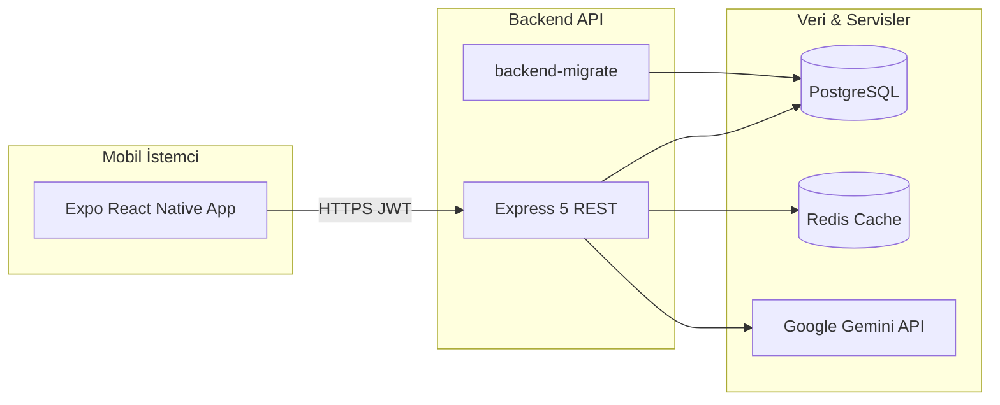

# Gym App — Full Stack Mobil Uygulama

Modern bir gym yönetim uygulaması: **React Native (Expo)** frontend, **Node.js (Express)** backend, **PostgreSQL**, **Redis** ve **Docker Compose**. Backend, [**12-Factor App**](https://12factor.net/tr/) prensiplerine uygun şekilde yapılandırılmıştır (merkezi config, stateless API, yapılandırılmış loglar, admin migration, CI/CD).

## İçindekiler

- [Özellikler](#özellikler)
- [Mimari ve 12-Factor](#mimari-ve-12-factor)
- [Teknolojiler](#teknolojiler)
- [Gereksinimler](#gereksinimler)
- [Hızlı Başlangıç](#hızlı-başlangıç)
- [Ortam Değişkenleri](#ortam-değişkenleri)
- [Docker (Geliştirme)](#docker-geliştirme)
- [Docker (Production)](#docker-production)
- [Backend (Manuel)](#backend-manuel)
- [Migration (Admin)](#migration-admin)
- [Frontend (Expo)](#frontend-expo)
- [CI/CD](#cicd)
- [API ve Health](#api-ve-health)
- [AI (Google Gemini)](#ai-google-gemini)
- [PgAdmin](#pgadmin)
- [Proje Yapısı](#proje-yapısı)
- [Sorun Giderme](#sorun-giderme)
- [Katkıda Bulunma](#katkıda-bulunma)

---

## Özellikler

### Mobil uygulama

- Kullanıcı kaydı ve girişi (JWT)
- Ana sayfa, egzersiz programları, AI ile program oluşturma
- Beslenme / diyet planları, AI asistan sekmesi
- Su takibi, adım özeti, başarımlar (XP / rozet)
- Profil, üyelik, açık / koyu tema (AsyncStorage)

### Sunucu

- REST API (Express 5), Clean Architecture (DDD)
- PostgreSQL + Redis (AI yanıt önbelleği)
- Swagger (`/api-docs`), yapılandırılmış JSON loglar (Pino)
- Google Gemini entegrasyonu

---

## Mimari ve 12-Factor

### Sistem Mimarisi



### 12-Factor Uyumluluğu

| # | Faktör | Projede nasıl karşılanıyor |
|---|--------|----------------------------|
| I | **Codebase** | Tek Git repo; backend + frontend |
| II | **Dependencies** | `package.json` + lock dosyaları |
| III | **Config** | `src/config/env.js` — secret'lar ortam değişkeninde; production'da `JWT_SECRET` zorunlu |
| IV | **Backing services** | PostgreSQL ve Redis tak-çıkar (host/port env ile) |
| V | **Build, release, run** | `Dockerfile` (build) → `backend-migrate` (release) → `backend` (run) |
| VI | **Processes** | Stateless API; oturum JWT ile |
| VII | **Port binding** | `PORT` env (varsayılan 3000) |
| VIII | **Concurrency** | `WEB_CONCURRENCY` ile Node cluster |
| IX | **Disposability** | `SIGTERM` / `SIGINT` → HTTP kapanış + DB pool + Redis |
| X | **Dev/prod parity** | `docker-compose.yml` (dev) / `docker-compose.prod.yml` (prod) |
| XI | **Logs** | Pino → stdout (JSON); merkezi log toplayıcıya hazır |
| XII | **Admin processes** | `npm run migrate` — tek seferlik SQL migration |

### Backend başlatma akışı

```text
server.js
  → config/env.js
  → DB + Redis bağlantısı
  → app.js (Express, route'lar)
  → listen(PORT)
```

- **`src/app.js`** — HTTP uygulaması (route, middleware, health)
- **`src/server.js`** — Süreç yönetimi (bağlantı, cluster, graceful shutdown)

---

## Teknolojiler

| Katman | Stack |
|--------|--------|
| Frontend | React Native, Expo 54, JavaScript, Axios, Redux Toolkit, AsyncStorage |
| Backend | Node.js 18+, Express 5, PostgreSQL (`pg`), Redis, JWT, Pino, Swagger |
| AI | Google Gemini API |
| DevOps | Docker, Docker Compose, GitHub Actions |

> Frontend kaynak kodu **JavaScript** (`.js`) dosyalarıdır.

---

## Gereksinimler

- **Node.js** 18+
- **npm**
- **Docker Desktop** (Compose: postgres, redis, backend, pgadmin)
- **Git**
- Mobil: **Expo Go** veya emülatör

---

## Hızlı Başlangıç

```bash
# 1) Repoyu klonla
git clone <repo-url>
cd <repo-adi>

# 2) Ortam dosyalarını oluştur
copy .env.example .env
copy gym-app-backend\.env.example gym-app-backend\.env
copy gym-app-frontend\.env.example gym-app-frontend\.env

# 3) Kök .env içine GEMINI_API_KEY ekle (isteğe bağlı)

# 4) Docker ile tüm stack
docker compose up -d --build

# 5) Frontend
cd gym-app-frontend
npm install
npx expo start
```

| Adres | Açıklama |
|-------|----------|
| http://localhost:3000/health | Sağlık kontrolü (DB + Redis durumu) |
| http://localhost:3000/api-docs | Swagger UI |
| http://localhost:5050 | PgAdmin |

---

## Ortam Değişkenleri

Gerçek secret'lar **asla** Git'e eklenmez. Şablonlar: `.env.example`, `gym-app-backend/.env.example`, `gym-app-frontend/.env.example`.

### Kök `.env` (Docker Compose → backend)

```env
GEMINI_API_KEY=
# Production compose için ayrıca:
# JWT_SECRET=guclu-rastgele-deger
# DB_PASSWORD=guclu-sifre
```

### `gym-app-backend/.env` (Docker olmadan yerel API)

```env
NODE_ENV=development
PORT=3000
PUBLIC_API_URL=http://localhost:3000

DB_HOST=localhost
DB_PORT=5432
DB_NAME=gym_app_db
DB_USER=postgres
DB_PASSWORD=postgres

JWT_SECRET=degistir_guclu_bir_sirre
JWT_EXPIRES_IN=7d

REDIS_ENABLED=true
REDIS_HOST=localhost
REDIS_PORT=6379

LOG_LEVEL=debug
WEB_CONCURRENCY=1
SHUTDOWN_TIMEOUT_MS=10000

GEMINI_API_KEY=
```

| Değişken | Açıklama |
|----------|----------|
| `NODE_ENV` | `development` \| `production` \| `test` |
| `JWT_SECRET` | Production'da **zorunlu**; kod içi varsayılan yok |
| `PUBLIC_API_URL` | Swagger ve dış URL |
| `WEB_CONCURRENCY` | `1` = tek süreç; `>1` = cluster worker |
| `LOG_LEVEL` | Pino seviyesi: `debug`, `info`, `warn`, `error` |

### `gym-app-frontend/.env`

```env
EXPO_PUBLIC_API_URL=http://BILGISAYAR_IP:3000/api
```

---

## Docker (Geliştirme)

`docker-compose.yml` — geliştirme ortamı (`Dockerfile.dev`, hot-reload volume).

```bash
docker compose up -d --build
docker compose ps
docker compose logs -f backend
docker compose down
```

| Servis | Port | Not |
|--------|------|-----|
| `postgres` | 5432 | Veri volume; şema `backend-migrate` ile |
| `backend-migrate` | — | Tek seferlik `npm run migrate` (XII) |
| `redis` | 6379 | AI cache |
| `backend` | 3000 | `npm run dev` (nodemon) |
| `pgadmin` | 5050 | `admin@gymapp.com` / `admin123` |

Veritabanını sıfırlamak (tüm veri silinir):

```bash
docker compose down -v
docker compose up -d
```

---

## Docker (Production)

`docker-compose.prod.yml` — production benzeri ayarlar (kaynak volume yok, sıkı secret kuralları).

```bash
# .env içinde JWT_SECRET ve DB_PASSWORD tanımlı olmalı
docker compose -f docker-compose.prod.yml --env-file .env up -d --build
```

Production: `backend-migrate` (release) tamamlanınca `backend` başlar → `node src/server.js`.

---

## Backend (Manuel)

PostgreSQL ve Redis ayaktayken:

```bash
cd gym-app-backend
npm install
npm run dev      # nodemon + server.js
# veya
npm start        # node src/server.js
npm test         # config unit testleri
npm run migrate  # admin migration (XII)
```

---

## Migration (Admin)

### Otomatik (Docker)

`docker compose up` sırasında `backend-migrate` servisi şemayı uygular; ardından API başlar.

### Manuel (12-Factor admin process)

Aynı config ve codebase ile:

```bash
cd gym-app-backend
npm run migrate
# veya release adımı olarak:
npm run release
```

- Dosyalar: `01_*.sql`, `02_*.sql`, … sıralı
- Uygulananlar `schema_migrations` tablosunda tutulur
- Tekrar çalıştırınca atlanır

Yeni migration eklemek:

1. `gym-app-database/` altına numaralı dosya ekle (örn. `16_yeni_tablo.sql`)
2. `npm run migrate` çalıştır

---

## Frontend (Expo)

```bash
cd gym-app-frontend
npm install
npx expo start
```

API adresi öncelik sırası:

1. `EXPO_PUBLIC_API_URL` (`.env`)
2. Expo dev server IP algılama (`api.js`)
3. Emülatör fallback (`10.0.2.2`)

Gerçek cihazda bilgisayar IP'si ile:

```env
EXPO_PUBLIC_API_URL=http://192.168.1.102:3000/api
```

### Tema

- `src/theme/ThemeContext.js`, `src/theme/palettes.js`
- Tercih AsyncStorage (`@gym_app_theme_mode`)

---

## CI/CD

GitHub Actions: `.github/workflows/backend-ci.yml`

Push / PR'da:

1. `npm ci`
2. Config doğrulama
3. `npm run migrate` (Postgres + Redis servisleri)
4. `npm test`
5. Production Docker image build
6. `npm start` + `/health` smoke test

---

## API ve Health

| Endpoint | Açıklama |
|----------|----------|
| `GET /health` | DB + Redis durumu; DB yoksa **503** |
| `GET /api-docs` | Swagger UI |
| `POST /api/auth/register` | Kayıt |
| `POST /api/auth/login` | Giriş (JWT) |
| `GET /api/auth/profile` | Profil (`Authorization: Bearer`) |

Örnek login:

```http
POST /api/auth/login
Content-Type: application/json

{
  "email": "user@example.com",
  "password": "password123"
}
```

---

## AI (Google Gemini)

1. https://aistudio.google.com/ → API key alın
2. Kök `.env` veya `gym-app-backend/.env` → `GEMINI_API_KEY=...`
3. `docker compose restart backend`

Modeller (sırayla denenir): `gemini-2.5-flash`, `gemini-2.5-pro`, `gemini-2.0-flash`, …

Key yoksa uygulama çalışır; AI özellikleri devre dışı kalır.

### Sık hatalar

| Hata | Çözüm |
|------|--------|
| API key yapılandırılmamış | `.env` + container restart |
| Kota aşıldı | Ertesi gün veya billing |
| Modül bulunamadı | `docker compose up --build -d` |

---

## PgAdmin

1. http://localhost:5050 — `admin@gymapp.com` / `admin123`
2. Register → Server → Connection:
   - Host: `postgres` (Docker ağı)
   - Port: `5432`, User: `postgres`, Password: `postgres`

---

## Proje Yapısı

```text
.
├── .github/workflows/backend-ci.yml
├── docker-compose.yml              # Geliştirme
├── docker-compose.prod.yml         # Production benzeri
├── .env.example
├── README.md
├── gym-app-backend/
│   ├── Dockerfile                  # Production (multi-stage)
│   ├── Dockerfile.dev              # Geliştirme
│   ├── scripts/
│   │   └── migrate.js              # XII — admin migration
│   ├── test/
│   │   └── config.test.js
│   ├── src/
│   │   ├── server.js               # Süreç giriş noktası
│   │   ├── app.js                  # Express uygulaması
│   │   ├── config/
│   │   │   ├── loadEnv.js
│   │   │   └── env.js              # III — merkezi config
│   │   ├── infrastructure/
│   │   │   ├── logging/logger.js   # XI — Pino
│   │   │   ├── database/connection.js
│   │   │   └── cache/
│   │   ├── application/
│   │   ├── domain/
│   │   └── presentation/
│   └── gym-app-database/           # SQL migration dosyaları
└── gym-app-frontend/
    ├── App.js
    ├── .env.example
    └── src/
        ├── screens/
        ├── services/api.js
        └── theme/
```

---

## Sorun Giderme

### Backend başlamıyor

```bash
# Production modda JWT_SECRET eksikse:
# Error: Production requires env: JWT_SECRET

docker compose logs backend
cd gym-app-backend && npm test
```

### Veritabanı / Redis

```bash
docker compose ps
docker compose restart postgres redis backend
```

### Port 3000 dolu (Windows)

```powershell
netstat -ano | findstr :3000
taskkill /PID <pid> /F
```

### Frontend ağ hatası

- Backend `/health` açılıyor mu?
- `EXPO_PUBLIC_API_URL` doğru IP mi?
- Telefon ve PC aynı Wi-Fi'de mi?

### Metro cache

```bash
cd gym-app-frontend
npx expo start --clear
```

### Logları okuma

Backend artık JSON log üretir:

```bash
docker compose logs -f backend
```

---

## Katkıda Bulunma

1. `git checkout -b feature/isim`
2. Değişiklik + test (`cd gym-app-backend && npm test`)
3. Commit ve Pull Request

Branch önerisi: `main` (kararlı), `dev` (entegrasyon), `feature/*`.

---

## Lisans

MIT

---

## Notlar

- Bu README, **12-Factor uyumlu backend** sürümünü anlatır.
- Bitirme projesi için eski sürüm Git geçmişinden geri alınabilir.
- Production kullanımında güçlü `JWT_SECRET`, HTTPS ve izleme (monitoring) eklenmesi önerilir.
