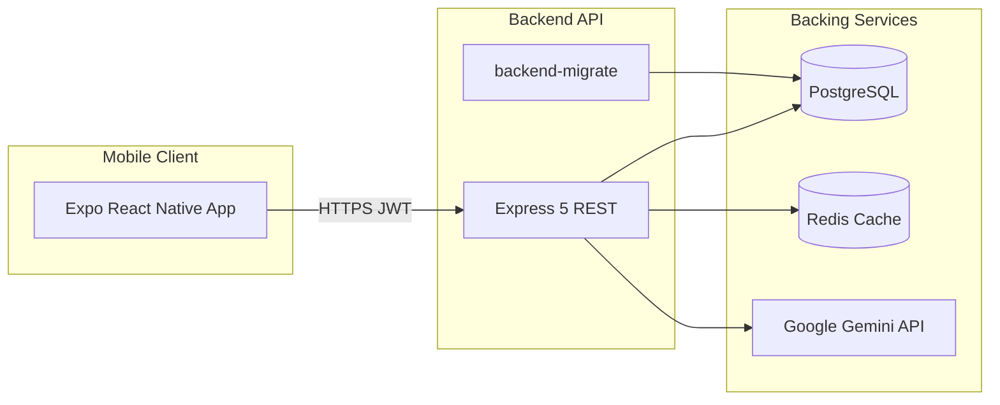
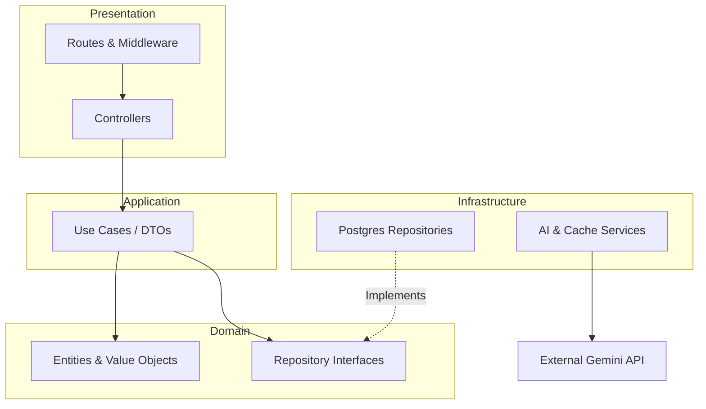
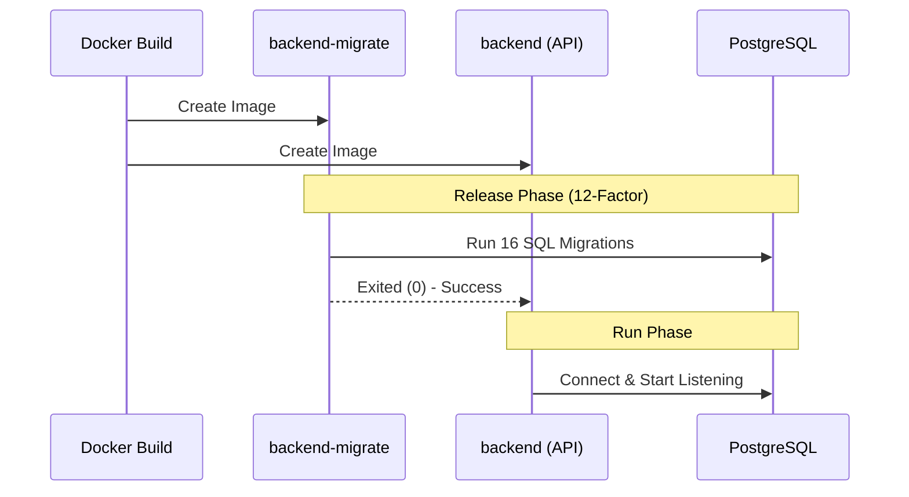

# Gym App: Full-Stack Fitness & AI Assistant Application

**Project Report**

**Student Name:** [Your Name]  
**University:** [Your University]  
**Department:** [Your Department]  
**Date:** [Date]  

---

## 1. Executive Summary

Gym App is a comprehensive, full-stack mobile fitness application designed to provide users with personalized workout routines, nutrition plans, and AI-driven health assistance. Built with a modern technology stack featuring React Native (Expo) for the frontend and Node.js (Express) for the backend, the application leverages PostgreSQL for persistent storage, Redis for caching, and Google Gemini for advanced AI capabilities. The backend architecture strictly adheres to the 12-Factor App methodology, ensuring scalability, maintainability, and seamless deployment via Docker Compose.

## 2. Introduction

Maintaining a healthy lifestyle requires consistent tracking of workouts, diet, water intake, and daily activity. Many existing solutions are either too fragmented or lack personalized guidance. Gym App addresses this problem by centralizing all fitness-related activities into a single, intuitive mobile interface. By integrating Google Gemini AI, the app offers dynamic, tailored exercise and nutrition plans, analyzing user inputs such as plate photos or form scores to provide actionable feedback.

## 3. System Overview

The project is structured as a monorepo containing both the mobile client and the backend API. 
- **Mobile Client:** A cross-platform application (iOS/Android) built with Expo and React Native, focusing on a responsive UI, offline-capable local storage (AsyncStorage), and device sensor integration (Health Connect, pedometer).
- **Backend API:** A RESTful API built with Node.js and Express, following Domain-Driven Design (DDD) and Clean Architecture principles. It connects to a PostgreSQL database and utilizes Redis to cache AI responses, reducing latency and API costs.

## 4. Key Features

| Feature Category | Description |
|------------------|-------------|
| **Authentication & Profile** | Secure JWT-based registration and login. User profile management including avatar uploads and Pro membership subscription handling. |
| **Exercise Programs** | Access to predefined workout routines and the ability to generate personalized, multi-week AI exercise programs based on user goals and physical metrics. |
| **Nutrition & AI Assistant** | AI-generated diet plans, interactive nutrition chat assistant, plate photo analysis for calorie/macro estimation, and exercise form scoring. |
| **Activity Tracking** | Daily water intake tracking with visual indicators, step counting via device sensors/Health Connect, and an XP/Badge-based achievement system to boost motivation. |
| **User Experience** | Full internationalization (i18n) supporting Turkish and English, along with a toggleable Light/Dark theme persistent across sessions. |

## 5. Technology Stack

| Layer | Technologies Used |
|-------|-------------------|
| **Frontend** | React Native 0.81, Expo 54, React Navigation 7, Redux Toolkit, Axios, AsyncStorage, Expo Audio/Sensors/Image Picker, Firebase |
| **Backend** | Node.js 18+, Express 5, PostgreSQL 15, Redis 7, JWT, Pino (structured logging), Swagger (API documentation) |
| **AI Integration** | Google Gemini API (`gemini-2.5-flash`, `gemini-2.5-pro`) |
| **DevOps & CI/CD** | Docker, Docker Compose, GitHub Actions, 12-Factor App principles |

## 6. Architecture

### 6.1 High-Level Architecture

### 6.2 Backend Layers (Clean Architecture)

### 6.3 Deployment Flow (Docker Compose)

## 7. Backend Design Highlights

The backend is strictly aligned with **12-Factor App** principles:
- **Config (III):** Centralized configuration via `src/config/env.js`. All secrets (e.g., `JWT_SECRET`, `GEMINI_API_KEY`) are injected via environment variables.
- **Backing Services (IV):** PostgreSQL and Redis are treated as attached resources.
- **Disposability (IX):** Implements graceful shutdown handling `SIGTERM`/`SIGINT` to safely close database pools and HTTP connections.
- **Admin Processes (XII):** Database migrations are executed as a one-off administrative process (`backend-migrate`) before the main API server boots up in production.
- **Performance:** Redis is heavily utilized to cache expensive AI generation tasks (e.g., nutrition plans, exercise programs) with configurable TTLs.

## 8. API Overview

The REST API is fully documented using Swagger. Once the backend is running, the interactive documentation is available at `/api-docs`.

| Route Prefix | Purpose |
|--------------|---------|
| `GET /health` | System health check (Database and Redis connection status). |
| `/api/auth` | Registration, login, profile management, and subscription handling. |
| `/api/foods` | Fetching food databases and nutritional information. |
| `/api/program`| Retrieving and generating user-specific workout programs. |
| `/api/ai` | Gemini AI endpoints: nutrition plans, plate analysis, form scoring, and Q&A. |

## 9. Database Schema

The PostgreSQL database is initialized and maintained through 16 sequential SQL migrations located in `gym-app-database/`. 

**Core Entities:**
- `users` & `user_details`: Authentication credentials, demographics, and physical metrics.
- `exercises` & `exercise_programs`: Catalog of available exercises and structured workout routines.
- `nutrition_plans`: AI-generated diet schedules.
- `achievements` & `user_xp_ledger`: Gamification data tracking user progress, milestones, and experience points.

## 10. Mobile App Structure

The frontend utilizes React Navigation with a modular stack approach:
- **AuthStack:** Handles onboarding, login, and registration.
- **UserStack:** The main authenticated flow featuring a custom animated bottom tab bar.
  - **Home:** Dashboard summarizing daily progress.
  - **Exercises:** Workout catalogs and AI program generator.
  - **Diet:** Nutrition tracking and AI chat assistant.
  - **Steps:** Pedometer and daily water intake tracker.
  - **Profile & Achievements:** User settings, XP progress, and earned badges.
- **Services:** Centralized API calls using Axios (`src/services/api.js`) with automatic token injection and error handling.

## 11. DevOps & Quality Assurance

- **Continuous Integration:** A GitHub Actions workflow (`.github/workflows/backend-ci.yml`) automatically runs on push/PR. It installs dependencies, validates configurations, runs the admin migrations against a test database, executes unit tests (`npm test`), and builds the production Docker image.
- **Dev/Prod Parity (X):** The project maintains separate `docker-compose.yml` (development) and `docker-compose.prod.yml` (production) files to ensure environments remain as similar as possible while enforcing strict security rules in production.

## 12. Screenshots & Visual Appendix

*(Please add your screenshots to the `docs/images/` folder to populate this section)*

### Authentication & Dashboard

*Figure 1: Login & Registration Screen*

*Figure 2: Main Dashboard*

### Fitness & Nutrition

*Figure 3: Exercise Programs & AI Generator*

*Figure 4: Nutrition Plan & AI Assistant*

### Tracking & Gamification

*Figure 5: Step Tracking and Water Intake*

*Figure 6: User Achievements and XP Ledger*

### Profile & Infrastructure

*Figure 7: User Profile and Settings*

*Figure 8: Swagger API Documentation*

*Figure 9: Docker Containers & Backend Logs*

## 13. Conclusion & Future Work

Gym App successfully demonstrates the integration of modern mobile development, robust backend architecture, and cutting-edge AI capabilities. By adhering to Clean Architecture and 12-Factor App principles, the system is highly scalable and maintainable.

**Future Enhancements:**
- **Offline Mode:** Implement robust offline-first capabilities using local SQLite or WatermelonDB for the mobile client.
- **Push Notifications:** Integrate Firebase Cloud Messaging (FCM) or Expo Notifications to remind users of workouts and water intake.
- **Production Hosting:** Deploy the backend to managed cloud services (e.g., AWS ECS, Render, or DigitalOcean) with automated CD pipelines.
- **Test Coverage:** Expand unit and integration test coverage for both the React Native frontend and the Express backend.

## 14. References

- [The Twelve-Factor App](https://12factor.net/)
- [React Native Documentation](https://reactnative.dev/)
- [Expo Documentation](https://docs.expo.dev/)
- [Express.js](https://expressjs.com/)
- [PostgreSQL](https://www.postgresql.org/docs/)
- [Redis](https://redis.io/documentation)
- [Google Gemini API](https://ai.google.dev/docs)